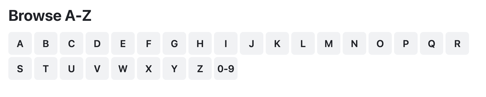

# SD555-June-2024-Final-Project

- It's advised to work on this project as **"standalone"**.
- You may also choose to work on this project as a **"team"**:
  - If you working as a **"team"**, please send me an email to confirm your option, otherwise, I will assume you are working as **"standalone"**.
  - To gain the most value of this project, it is advised to divide the work between the two team members, and not work on the same task.
  - Only one member will "Accept/Fork" the repository. Please add your team member as "collaborators", so they could push their daily progress to the same repository.

## Medication Reviews/Side-Effects application:

The application helps users to review and report medications side effects.

<p align="center">
  
</p>

1. Guests browse the medications by the first letter. Display all the alphabet letters, when a letter is clicked all medications starting with the letter are fetched and displayed. All guests can read the reviews. You may use the [Drugs.com](https://www.drugs.com/drug_information.html) to see sample data.
2. Guests will need to signup and signin before they can add medications or reviews.
3. Users may add medications. Only the medication owner may update or delete their medication.
4. Users may submit reviews. Only the review owner may update or delete their reviews.

### Application specifications and requirements

Your project must use the following:

- Implement a login-based system with JWT.
- Browsing medications and reading reviews is open to guests, but adding, updating, and deleting functionality is restricted to logged-in users.
- State properties in all components and services should be declared as a `signal`.
- Implement proper lazy-loading techniques for the user-protected components.
- Projects must use Angular Material and have proper UI that complies with the web standards. Other UI kits are not permitted.
- You must use the latest Angular version features, and avoid using any legacy Angular APIs.
- You must use the `ReactiveFormsModule` when working with form elements (data-driven). The `FormsModule` (template-driven) should not be used.

### Notes

- Do not make any modifications to the provided backend code. However, you are allowed to add new backend features only when you opt-in for the optional extra points, or working as a team-of-two students, as per the details described in the sections below.
- A daily push is required to track your code progress and measure your performance. You may only use and submit code to the repository provided by `maharishi-university` organization, do not submit code to your personal repository.
- Students are expected to be available on MS-Teams to receive calls and check on their progress.

## Teams Requirements

This does NOT apply to standalone students (\*). Only those who are working as a team must complete the following requirements:

1. Update both the frontend and backend to support uploading multiple images for the medication.
2. Update both the frontend and backend to support filtering the medications to display the medications submitted by the user.

_(\*) Standalone students will not receive any extra points for working or finishing the above requirements._

## +2 Optional Extra Points

All Students (standalone or teams) may finish the following feature and receive 2 extra points (\*) toward their final exam grade:

- Implement a new backend API/route to check if the medication name exists or not. This will be used from an asynchronous validator to invalidate the form status in the frontend.

_(\*) Standalone students will receive 2 extra points, and students working in teams will receive 1 extra point each_

## +2 Optional Extra Points

All Students (standalone or teams) may finish the following task and receive 2 extra points (\*) toward their final exam grade:

- Build you Angular project and modify the backend code to serve the Angular SPA as follows:
  - Define an `Express.static()` middleware that serves the Angular SPA.
  - Define a backend fallback route that serves the Angular SPA for any undefined backend route.

_(\*) Standalone students will receive 2 extra points, and students working in teams will receive 1 extra point each_

## Need assistance?

Feel free to contact me any day between 10:00 AM to 12:00 PM, and 2:00 PM to 5:00 PM, except for Sunday. I’m available to assist all teams with all kinds of requests (system design, backend, frontend, fixing code bugs.. etc). The project is a learning experience and I want everyone to finish the project successfully and meet the course learning outcomes.

## Final Evaluation

- The submission deadline is on Monday at 9:00 PM. I will meet with every student individually on Wednesday and Thursday and evaluate the final project code. The technical evaluation schedule TBD later.
- It's advised that you submit your code on Sunday evening, and prepare for your final exam on Monday.
- Your final exam will be on Tuesday, from 10:00 AM to 12:00 PM, in the Foster 336 classroom.

Good luck, and happy coding!

_Code Honor Submission Policy: Remember to respect the code honor submission policy. All written code must be original. You may not share any part of your code with other students. Code duplications will results to receiving NC for the final project. Presenting any code as one’s own work when it came from another source is plagiarism, which includes any matching patterns and code snippets, and will affect your grade. The use of AI is not permitted in this assignment. For more details, check the full course policies in the syllabus._

```typescript
export type User = { _id: string, fullname: string, email: string, password: string }
export type Image = { filename: string, originalname: string }
export type Review = { review: string, rating: number, by: { user_id: string, fullname: string }, date: number }
export type Owner = { user_id: string, fullname: string, email: string }
export type Medication = {
    name: string,
    first_letter: string,
    generic_name: string,
    medication_class: string,
    availability: string,
    image: Image,
    added_by: Owner,
    reviews: Review[]
}
// POST /users/signin
request_body = { "email": string, "password": string }
response_body = { "success": boolean, "data": string } // JWT token

// POST /users/signup
request_body = { "fullname": string, "email": string, "password": string }
response_body = { "success": boolean, "data": User } // JWT token

// POST /medications
request_body = { "name": string, "generic_name": string, "medication_class": string, "availability": "Prescription" | "OTC" }
request_multipart = "medication_image"
response_body = { "success": boolean, "data": Medication }

// GET /medications?first_letter=A
response_body = { "success": boolean, "data": Medication[] } // only name

// PUT /medications/:medication_id
request_body = { "name": string, "generic_name": string, "medication_class": string, "availability": string }
request_multipart = "medication_image"
response_body = { "success": boolean, "data": boolean }

// GET /medications/:medication_id
response_body = { "success": boolean, "data": Medication } // without reviews

// DELETE /medications/:medication_id
response_body = { "success": boolean, "data": boolean }

// POST /medications/:medication_id/reviews
request_body = { "review": string, "rating": number }
response_body = { "success": boolean, "data": string } // review_id

// GET /medications/:medication_id/reviews
response_body = { "success": boolean, "data": Review[] } // only name

// PUT /medications/:medication_id/reviews/:review_id
request_body = { "review": string, "rating": number }
response_body = { "success": boolean, "data": boolean }

// GET /medications/:medication_id/reviews/:review_id
response_body = { "success": boolean, "data": Review }

// DELETE /medications/:medication_id/reviews/:review_id
response_body = { "success": boolean, "data": boolean }

// GET /medications/images/:image_id
response_body = Binary of image file
```
